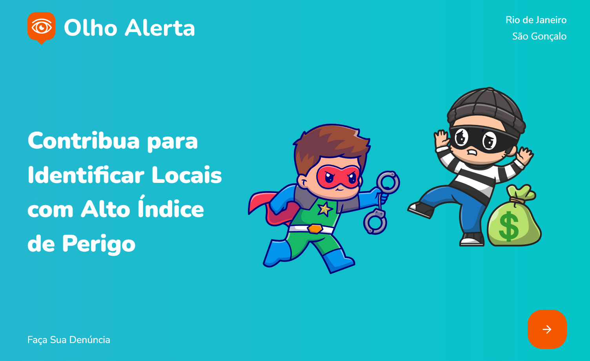

<h1 align="center">Olho Alerta - Back-End</h1>

<h1 align="center">
    
</h1>

## Tecnologias 🚀

- [Node.js](https://nodejs.org/en/)
- [Express](https://expressjs.com/pt-br/)
- [MySQL](https://www.sqlite.org/index.html)
- [JavaScript](https://www.javascript.com/)

## 📖 Sobre
Olho Alerta é uma aplicação que tem o intuito de cadastrar denuncias que ocorrer no dia a dia. 

Esta aplicação foi desenvolvida para as aulas de Back-End do Firjan Senai dias 5 a 11 de Abril de 2024.

## 🔖 Layout

- [Layout Web]() 

## 🤔 Como usar 

   ```
   - Clone o repositório:
   $ git clone https://github.com/jeferson8458/OlhoAlertaFront.git

   - Entre no diretório:
   $ cd OlhoAlerta-BackEnd

   - Instale as dependências:
   $ npm install

   - Execute a aplicação:
   $ npm run dev

   - Abra seu navegador em:
   http://localhost:3333
   ```

